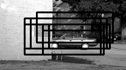
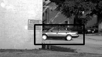
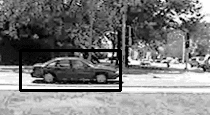
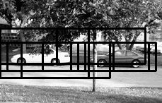
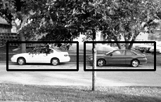

# object-detection using NMS
Object Detector using NMS. | [Video](https://youtu.be/Ykmi1wlGILE)

## Run the code

I have created a single python script that can be used to test the code. To test the code, run the lines below in your terminal.

```shell
git clone https://github.com/bikz05/object-detector.git
cd object-detector/bin
test-object-detector
```

_The `test-object-detector` will download the [UIUC Image Database for Car Detection](https://cogcomp.cs.illinois.edu/Data/Car/) and train a classifier to detect cars in an image. The SVM model files will be stored in `data/models`, so that they can be resused later on._

### Configuration File

All the configurations are in the `data/config/config.cfg` configuration files. You can change it as per your need. Here is what the default configuration file looks like (which I have set for Car Detector)-

```bash
[hog]
min_wdw_sz: [100, 40]
step_size: [10, 10]
orientations: 9
pixels_per_cell: [8, 8]
cells_per_block: [3, 3]
visualize: False
normalize: True

[nms]
threshold: .3

[paths]
pos_feat_ph: ../data/features/pos
neg_feat_ph: ../data/features/neg
model_path: ../data/models/svm.model
```

### About the modules

* `extract-features.py` -- This module is used to extract HOG features of the training images.
* `train-classifier.py` -- This module is used to train the classifier.
* `nms.py` -- This module performs Non Maxima Suppression.
* `test-classifier.py` -- This module is used to test the classifier using a test image.
* `config.py` -- Imports the configuration variables from `config.cfg`.

## Some of the results

#### Test Image 1
_Detections before NMS_            |  _Detections after NMS_
:-------------------------:|:-------------------------:

 |  

#### Test Image 2
_Detections before NMS_            |  _Detections after NMS_
:-------------------------:|:-------------------------:

) |  
#### Test Image 3
_Detections before NMS_            |  _Detections after NMS_
:-------------------------:|:-------------------------:

 |  
#### Test Image 4
_Detections before NMS_            |  _Detections after NMS_
:-------------------------:|:-------------------------:

 |  

## TODO

Here is list of tasks that I am planning to implement in the future -

* Optimize code to use more `numpy` vectorized codes.
* Faster NMS code.
* Add bootstrapping (Hard Negative Mining) code.


## Useful tutorials

1. [Histogram of Oriented Gradients and Object Detection](http://www.pyimagesearch.com/2014/11/10/histogram-oriented-gradients-object-detection/)
2. [Image Pyramids with Python and OpenCV](http://www.pyimagesearch.com/2015/03/16/image-pyramids-with-python-and-opencv/)
3. [Sliding Windows for Object Detection with Python and OpenCV](http://www.pyimagesearch.com/2015/03/23/sliding-windows-for-object-detection-with-python-and-opencv/)
4. [Non-Maximum Suppression for Object Detection in Python](http://www.pyimagesearch.com/2014/11/17/non-maximum-suppression-object-detection-python/)
5. [(Faster) Non-Maximum Suppression in Python](http://www.pyimagesearch.com/2015/02/16/faster-non-maximum-suppression-python/)
6. [Histogram of Oriented Gradients and Object Detection](https://sites.google.com/view/geeky-traveller/computer-vision/histogram-of-oriented-gradients-and-object-detection)
# Resources:

To learn more about these Resources you can Refer to some of these articles written by Me:-

https://sites.google.com/view/geeky-traveller/computer-vision/histogram-of-oriented-gradients-and-object-detection

# Resources 

To learn more about these Resources you can Refer to some of these articles written by Me:-

- [Medium](https://medium.com/geeky-bawa)
- [geeky Traveller](https://sites.google.com/view/geeky-traveller/)
- [Blogs](https://github.com/vaibhavhariaramani/blogs)
- [Youtube](https://www.youtube.com/channel/UCy7amUpLnsRLEMIaJGGBYog)[](https://www.youtube.com/channel/UCy7amUpLnsRLEMIaJGGBYog)

### Don't forget to tag us

if you use this repo in  your project don't forget to mention us as Contributer in it . And Don't forget to tag us [Linkedin](https://www.linkedin.com/in/vaibhav-hariramani-087488186/),[ instagram](https://www.instagram.com/geeky_baba_/?hl=en),[ facebook](https://www.facebook.com/jayesh.hariramani.3) ,[ twitter](https://www.linkedin.com/in/vaibhav-hariramani-087488186/), [ Github](https://github.com/vaibhavhariaramani) 

============================================================================
# Made with ❤️by Vaibhav Hariramani
#### About me

I am a Machine Learning enthusiast, an Actions on Google Developer, Internet of things, Alexa Skills, and Image processing developer.
I have a keen interest in Image processing and Andriod development.
I am Currently studying at  Chandigarh University, Punjab.

[My PortFolio](https://vaibhavhariaramani.github.io/)
You can find me at:-
[Linkedin](https://www.linkedin.com/in/vaibhav-hariramani-087488186/) or [Github](https://github.com/vaibhavhariaramani) .

Email: [vaibhav.hariramani01@gmail.com](mailto:vaibhav.hariramani01@gmail.com)


# Download [THE VAIBHAV HARIRAMANI APP](https://github.com/vaibhavhariaramani/The-Vaibhav-Hariramani-App/raw/master/vaibhav%20hariramani%20app.apk)

# [](https://github.com/vaibhavhariaramani/The-Vaibhav-Hariramani-App/raw/master/vaibhav%20hariramani%20app.apk) 
<p align='center'>
<a href="https://www.linkedin.com/in/vaibhav-hariramani-087488186/"></a>&nbsp;&nbsp;
<a href="https://twitter.com/vaibhavhariram2"></a>&nbsp;&nbsp;
<a href="https://www.instagram.com/vaibhav.hariramani/?hl=en"></a>&nbsp;&nbsp;
<a href="https://www.buymeacoffee.com/vaibhavJii"></a>
<a href="https://wa.me/+917790991077"></a>&nbsp;&nbsp;
<a href="mailto:vaibhav.hariramani01@gmail.com"></a>&nbsp;&nbsp;
</p>


[The Vaibhav Hariramani App (Latest Version) ](https://github.com/vaibhavhariaramani/The-Vaibhav-Hariramani-App/raw/master/vaibhav%20hariramani%20app.apk)

Download [THE VAIBHAV HARIRAMANI APP](https://github.com/vaibhavhariaramani/The-Vaibhav-Hariramani-App/raw/master/vaibhav%20hariramani%20app.apk) consist of Tutorials,Projects,Blogs and Vlogs of our Site developed Using Android Studio with Web View try installing it in your android device.

Happy coding ❤️ .

### Follow me
  
[](https://www.linkedin.com/in/vaibhav-hariramani-087488186/) [](https://www.instagram.com/vaibhav.hariramani/?hl=en) [](https://twitter.com/vaibhavhariram2) [](https://github.com/vaibhavhariaramani) [](mailto:vaibhav.hariramani01@gmail.com) [](https://medium.com/geeky-bawa) 
